<div align="center">


# Arsenal

### Everything your ROG or TUF laptop can do, in one window.

Fan curves, power limits, GPU modes, panel settings, charge limits and Aura lighting.
Native Windows, no account, no background service stack, about 12 MB on disk.

[](LICENSE)
[](https://github.com/kanishka-wijesuriya/Arsenal/actions/workflows/build.yml)
[](#requirements)
[](https://dotnet.microsoft.com/download/dotnet/10.0)

**[Download](https://get-arsenal.com/download)** &nbsp;·&nbsp;
[Requirements](#requirements) &nbsp;·&nbsp;
[Build from source](#build-it-yourself) &nbsp;·&nbsp;
[Credits](#built-on-g-helper)

<br>

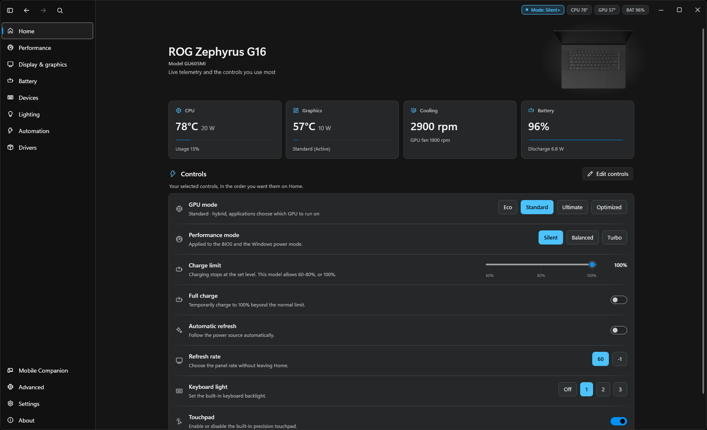

</div>

<br>

## One window instead of a suite

Arsenal talks to the same ASUS firmware Armoury Crate does, and stops there. No account,
no launcher, no promotions, no telemetry, no background service stack waiting for you to
open something.

It is also **honest about your hardware**. Every control is capability-gated: Arsenal
probes what your particular chassis exposes and hides what it cannot reach, rather than
showing you a switch that silently does nothing. Sliders bind to the range the firmware
reports, so you cannot set a value the machine will quietly discard.

<br>

## What you can control

### Performance

Silent, Balanced and Turbo, or your own profile. Sustained, burst and peak power limits,
CPU undervolt, Windows boost policy, temperature ceiling, per-profile GPU clock offsets,
and fan curves with sensor calibration. Everything on this page belongs to the profile
selected at the top, so switching profiles loads its own saved values.

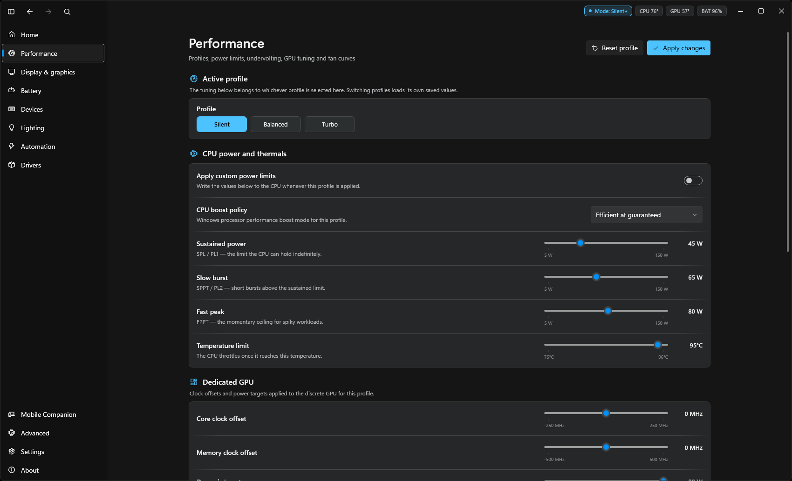

### Lighting

Aura effects, brightness and colour, the light bar, AniMe Matrix and Slash, and rules for
what the keyboard does when the laptop sleeps, boots or runs on battery.

The preview is drawn for **your** keyboard. Arsenal matches the chassis to a layout and
animates the effect from its shape, colour and speed. Nothing on an ASUS machine reports
whether it physically has a number pad, so the number pad and ISO Enter switches are
there to correct it, and your answer is remembered.

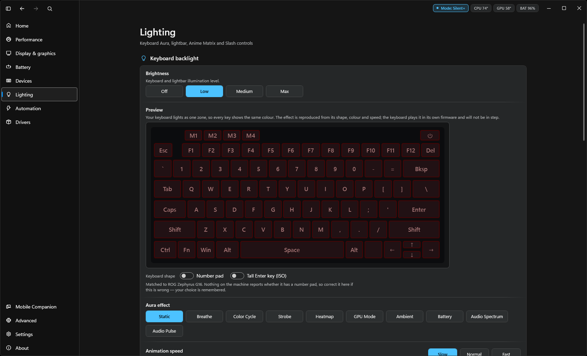

### Mobile companion

Pair an Android phone over your own network and control the same things from it. The
pairing screen shows a QR code carrying the address, port, a five-minute one-time code
and the TLS fingerprint your phone will pin.

Control never leaves your LAN. Every phone gets its own revocable credential, and you can
see what is connected and cut it off from here.

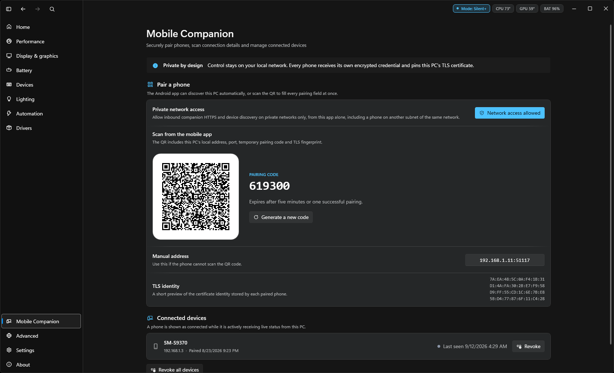

### And the rest

| | |
| --- | --- |
| **Display & graphics** | GPU Eco, Standard, Ultimate and Optimized. Refresh rate and automatic switching, panel overdrive, Mini-LED modes, HDR, GameVisual and gamut, white point, OLED software dimming, XG Mobile |
| **Battery** | Charge limit, full-charge override, and the Windows charging indicator |
| **Devices** | ASUS mice and keyboards, with DPI, polling rate and sleep timers written straight to the device |
| **Drivers** | Finds what ASUS drivers you have installed and compares them against ASUS support |
| **Automation** | Startup actions, clamshell behaviour, and scheduled battery and backlight rules |
| **Advanced** | ASUS service control, firmware switches, power policy, and ROG Ally AutoTDP and FPS limiting |

Plus a tray menu, a quick panel on a hotkey, a searchable command palette, a hardware
overlay with live FPS, and **22 interface languages**.

<details>
<summary><b>More screenshots</b></summary>
<br>

**First run.** Arsenal asks before it changes anything on your machine.

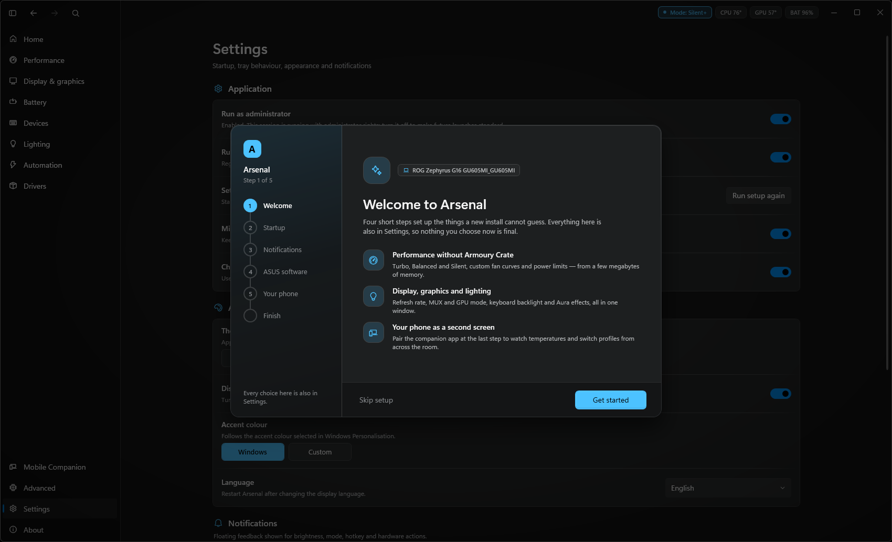

**Display & graphics**

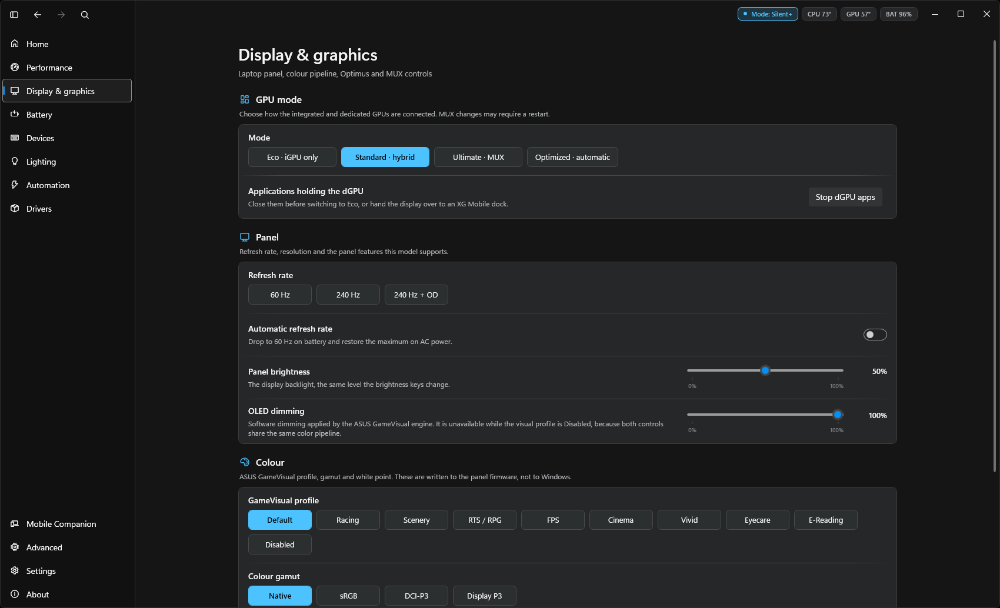

**Battery**

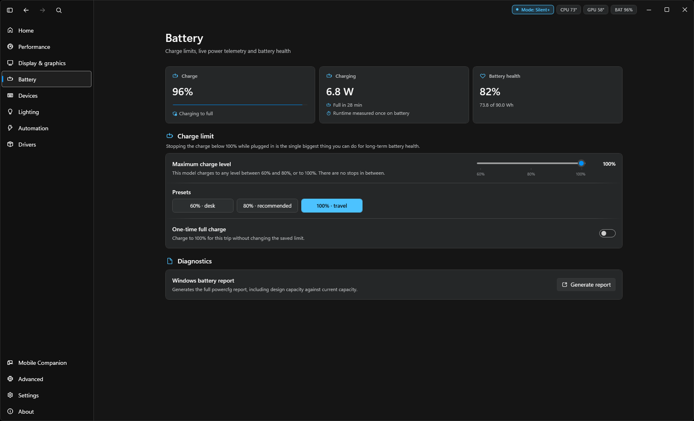

**Devices**

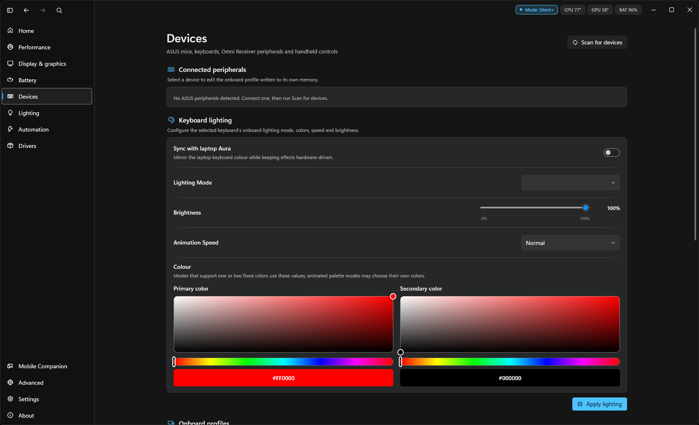

**Automation**

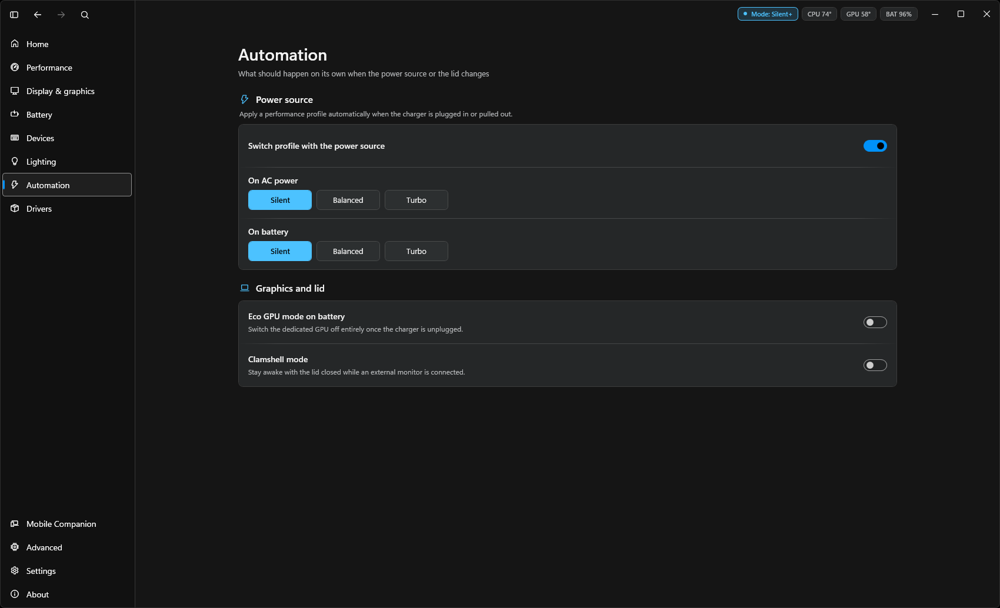

**Drivers**

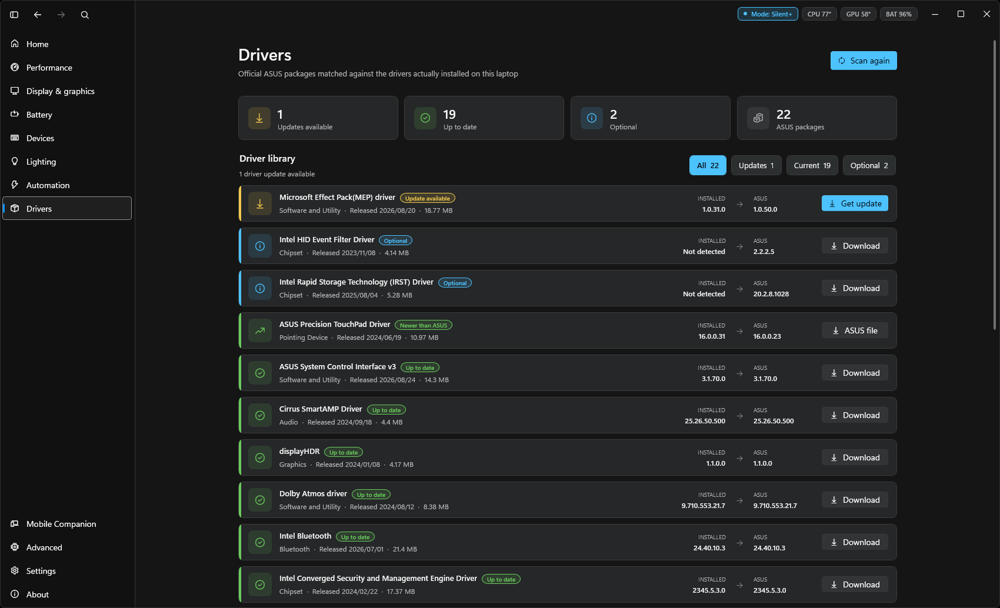

**Advanced**

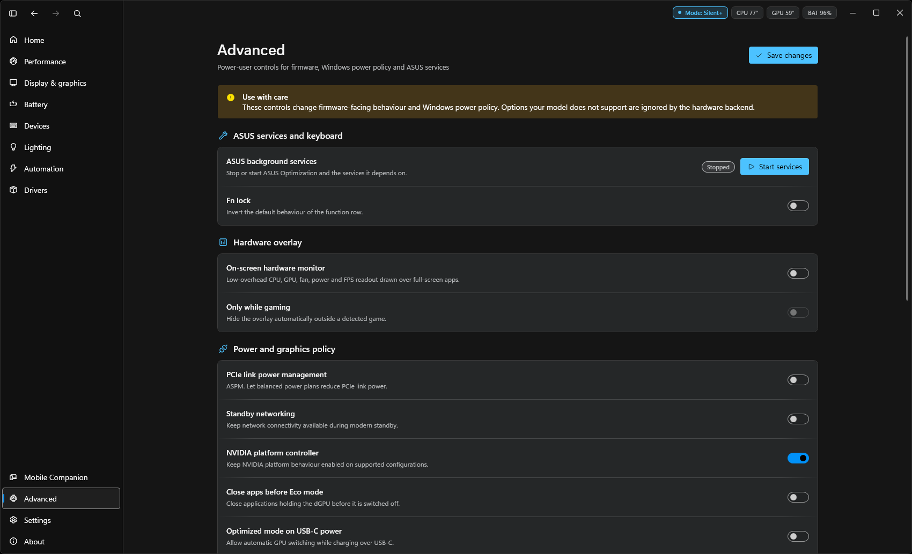

**Settings**

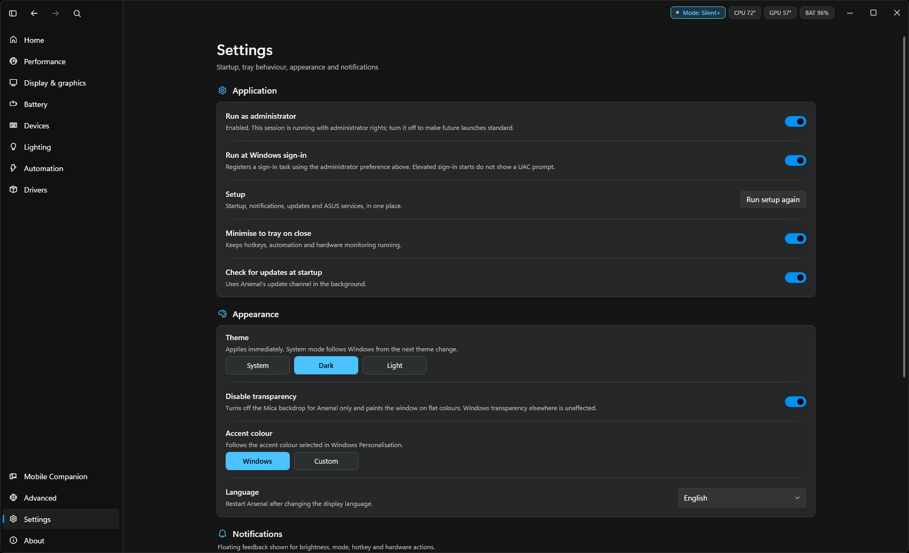

**About**

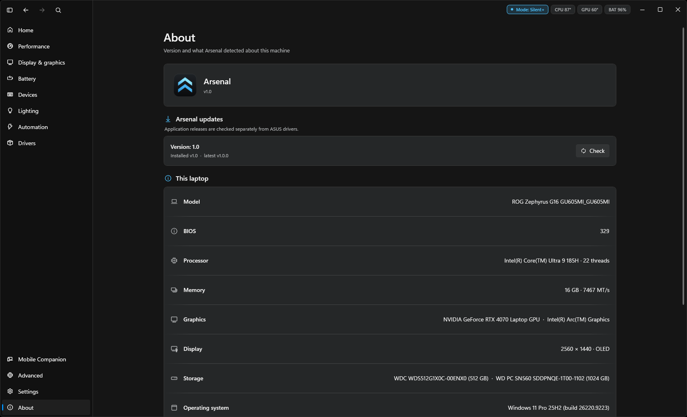

</details>

<br>

## Requirements

| | |
| --- | --- |
| **OS** | Windows 11, 64-bit. There is no 32-bit or ARM build, and no Linux or macOS version |
| **Hardware** | An ASUS **ROG, TUF, Zephyrus, Flow, Strix, Scar** or **ROG Ally** machine. Other ASUS models often work in part. Non-ASUS hardware does not, because there is no ASUS ACPI interface to talk to |
| **Runtime** | [.NET 10 Desktop Runtime](https://dotnet.microsoft.com/download/dotnet/10.0) (x64) for the lightweight build |
| **Rights** | Runs without administrator rights. Power-limit writes, undervolting and ASUS service control need elevation, and say so where they appear |

Everyday hardware control works offline. Update checks, driver discovery and colour
profile downloads need the internet.

<br>

## Build it yourself

You need the [.NET 10 SDK](https://dotnet.microsoft.com/download/dotnet/10.0) on Windows.

```powershell
dotnet build Arsenal.slnx -c Release
dotnet test Arsenal.Tests/Arsenal.Tests.csproj
```

The build is expected to report **0 warnings**. `CS8602` and `CS8604` are deliberately
not suppressed, so a nullability warning is a real finding.

<details>
<summary>A single portable executable</summary>
<br>

```powershell
dotnet publish Arsenal.UI/Arsenal.UI.csproj -c Release -p:Platform=x64 -r win-x64 `
  --self-contained false -p:PublishSingleFile=true `
  -p:IncludeNativeLibrariesForSelfExtract=true -o artifacts/win-x64
```

The result is `artifacts/win-x64/Arsenal.exe`.

</details>

<details>
<summary>An MSIX package for the Microsoft Store</summary>
<br>

```powershell
./tools/build-store-msix.ps1
```

Store builds define the `ARSENAL_STORE` symbol, which compiles out the self-update path
entirely. The Store does the updating, and an app that replaces its own binary underneath
a Store install is broken. The script writes its output to a `releases/` folder **beside**
the repository, not inside it.

</details>

<br>

## How it is laid out

```
Arsenal.Core         ASUS hardware: ACPI/WMI, HID, fans, GPU, display, battery,
                     lighting, AniMe Matrix, peripherals, input, the update client
Arsenal.Application  Typed services and models the UI binds to. Hardware access sits
                     behind interfaces so it can be reasoned about without a machine
Arsenal.UI           WPF shell: pages, tray, quick panel, command palette, overlays,
                     and the local companion bridge
Arsenal.Tests        xUnit. Deliberately narrow: version comparison, the signed update
                     envelope, range clamping and the companion pairing rules
tools/               Build and release scripts, plus *-smoke harnesses that lay out
                     real views and render them to PNG without any hardware attached
StorePackage/        Manifest template and icons for the Microsoft Store MSIX
docs/                Contributing guide, security policy, code of conduct, screenshots
```

The version lives in exactly one place, [`Directory.Build.props`](Directory.Build.props),
and all four projects inherit it.

<br>

## Updates, and why you can trust them

Arsenal checks a signed feed on `get-arsenal.com`. The envelope is RSA-SHA256 signed and
the client trusts a **set** of keys chosen by the envelope's `key_id`, so a key can be
rotated without stranding copies already installed. An unrecognised key id is refused
outright rather than falling back to trying every key. A downloaded package is checked
against both its declared size and its SHA-256 before anything is launched.

That, the size check and the hash are the whole of the update system's security. They
prove package integrity and release authority. They are **not** a substitute for Windows
Authenticode signing, which needs a certificate this project does not yet hold, so
SmartScreen will warn on download. [`tools/sign-release.ps1`](tools/sign-release.ps1) is
ready for one and exits with an explanation rather than pretending when none is present.

The feed client is
[`Arsenal.Core/AutoUpdate/ReleaseFeedClient.cs`](Arsenal.Core/AutoUpdate/ReleaseFeedClient.cs),
and it is short enough to read in one sitting.

<br>

## Command-line options

| Argument | Effect |
| --- | --- |
| `--startup`, `--minimized`, `-m` | Start in the tray |
| `--quick` | Open only the quick panel |
| `charge` | Scheduled battery-limit and backlight startup action |
| `cpu`, `gpu`, `uv` | Open the relevant performance controls |
| `services` | Open advanced ASUS service controls |
| `colors` | Install the model-specific colour profile and open Display |
| `autoupdate` | Run the update path |

`--quick-test` and `--tray-test` are diagnostic variants that expose the quick panel and
tray menu for automated UI inspection.

<br>

## Built on G-Helper

**Arsenal's hardware layer is [G-Helper](https://github.com/seerge/g-helper) by
[Serge (@seerge)](https://github.com/seerge).** That is not a footnote. `Arsenal.Core` is
a direct derivative: of the 110 source files the two projects share, **96.7% of the
upstream lines are present here verbatim**. Every ACPI call, every fan curve and every
register write that makes this software work came from that project.

Arsenal is GPL-3.0-or-later as a result. That is an obligation of the licence, not a
preference. What Arsenal adds on top is the WPF shell, the service and view-model layer,
and the update client, and those are GPL-3.0 too, because they ship as one program with
the code above.

If Arsenal is useful to you, **[go and support G-Helper](https://github.com/seerge/g-helper)**.
It came first and it did the hardest part.

[`NOTICE.md`](NOTICE.md) records what came from where in detail, including
[Starlight](https://github.com/vddCore/Starlight) for the AniMe Matrix work, AMD's
display-library interop definitions, and every bundled package.

<br>

## Contributing

See [`docs/CONTRIBUTING.md`](docs/CONTRIBUTING.md). The short version: the licence
obligations in [`NOTICE.md`](NOTICE.md) are not negotiable, the version gets bumped on
every build, a clean build means zero warnings, and no test gets deleted to make a build
pass.

Security issues go to [`docs/SECURITY.md`](docs/SECURITY.md), not the public issue
tracker. Behaviour in project spaces is covered by the
[code of conduct](docs/CODE_OF_CONDUCT.md).

<br>

## Licence

**GNU General Public License, version 3 or later.** Full text in [`LICENSE`](LICENSE),
copyright and third-party notices in [`NOTICE.md`](NOTICE.md).

This repository is the complete corresponding source for released `Arsenal.exe` builds,
and every release is tagged. If you hold an Arsenal binary and cannot get the source for
that exact version, that is a bug. Please report it.

<br>

<div align="center">

ASUS, ROG, TUF, Armoury Crate, Aura and AniMe Matrix are trademarks of ASUSTeK Computer
Inc.<br>Arsenal is an independent project, and is not affiliated with, endorsed by or
supported by ASUSTeK Computer Inc.

</div>
